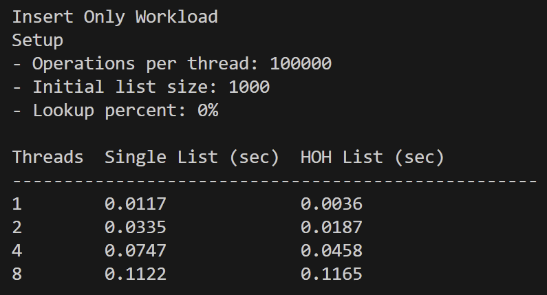
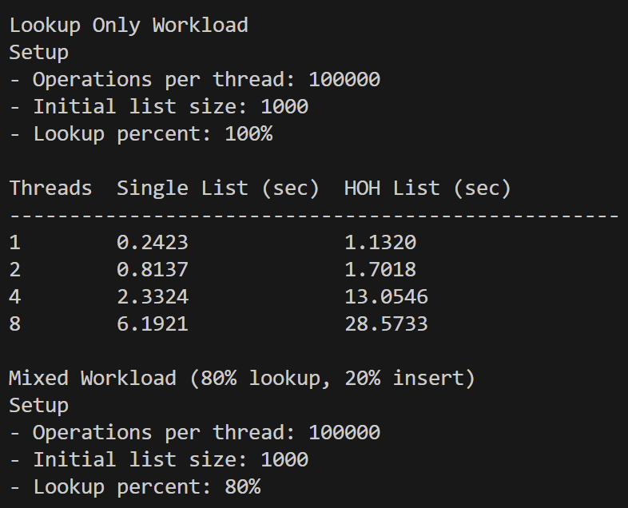
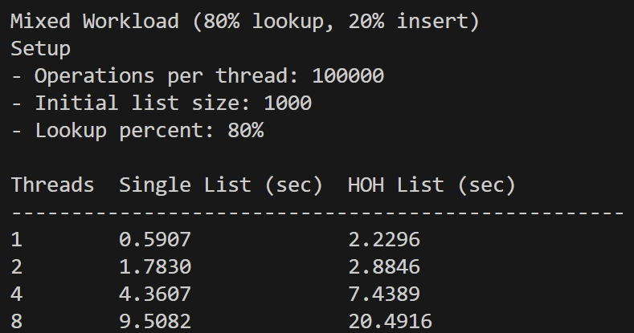

# **list-reflections.pdf**

**Name:** Jane Choi  
**Course:** CSS430   
**Assignment:** Threads Homework

## **Overview**

In this assignment, I implemented two concurrent linked list designs: 

1. A single-lock linked list, where the entire list is protected by one global mutex.   
2. A hand-over-hand (HOH) linked list, where each node has its own mutex, and locks are acquired during traversal. 

The purpose of this assignment was to compare how these two locking strategies perform under different workloads and thread counts. 

The benchmark program runs multiple threads and measures the time required to perform operations on the list. 

## **Single Lock List Design** 

The single-lock list protects the entire linkedlist with a single global mutex.   

Before performing any operation, the thread acquires the list lock. The thread then performs traversal or insertion while holding the lock and releases the lock when finished. 

Example pattern: 
```
lock(list)
perform operation
unlock(list)
```

## **Hand-over-Hand (HOH) Locking Design** 

The HOH list uses fine-grained locking. Each node contains its own mutex.   

During traversal, the algorithm follows the hand-over-hand locking pattern described in the textbook: 

```
Lock the current node
Lock the next node
Unlock the current node
Move forward
```

This allows multiple threads to traverse different parts of the list simultaneously. 

However, this approach introduces additional overhead because every node traversal requires multiple lock and unlock operations.

## **Test Setup**

The benchmark program runs a set of operations using multiple threads 

Each thread repeatedly performs either a lookup or an insert.   
The following workloads were tested: 

**Insert-only workload**  
0% lookup, 100% insert 

**Lookup-only workload**   
100% lookup 

**Mixed workload**   
80% lookup, 20% insert 

**Thread counts tested:**   
1, 2, 4, 8 threads 

**Each thread performs:**   
100000 operations 

**The list was prefilled with:**   
1000 elements

## **Test Results**

### **Insert Only Workload**


**Observation:**   
HOH performed similarly or slightly faster than insert-only operations. This is likely because insertion occurs near the front of the list and does not require full traversal. 

### **Lookup Only Workload** 


**Observation:**   
The HOH list became significantly slower as the thread count increased. This is due to the overhead of locking and unlocking each node during traversal. 

### **Mixed Workload (80% Lookup, 20% Insert)** 


**Observation:**   
The single-lock list performed better in the mixed workload. Because lookup operations dominate the workload, the extra locking overhead in the HOH list significantly increased the runtime. 

## **Reflection**

This assignment helped me to understand the differences between coarse-grained locking and fine-grained locking. 

The single lock list is simple but limits concurrency. The hand-over-hand list allows multiple threads to traverse different parts of the list simultaneously. 

My result shows that fine-grained locking does not always improve performance. The hand-over-hand list often performed worse because of the large number of lock and unlock operations during traversal. 

In summary, the single lock list demonstrated improved performance in lookup-heavy and mixed workloads. Additionally, the choice of what to use depends on the specific situation. There is no absolute good or bad. 

## **Run the Program**
```
gcc main.c linkedlist.c \-pthread \-o locks  
./locks
```

## Files Added/Edited
| File |
|-----|
| [Threads HW Part 1.pdf](./Threads%20HW%20Part%201.pdf) |
| [locks.pdf](./locks.pdf) |
| [linkedlist.c](./linkedlist-c/linkedlist.c) |
| [linkedlist.h](./linkedlist-c/linkedlist.h) |
| [main.c](./linkedlist-c/main.c) |
| [valgrind_output.txt](./linkedlist-c/valgrind_output.txt) |

## Code References
Chapter 29 Page 9~
